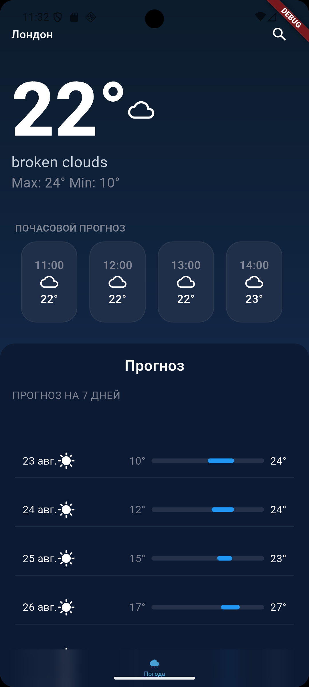
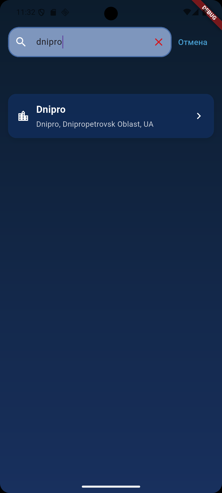
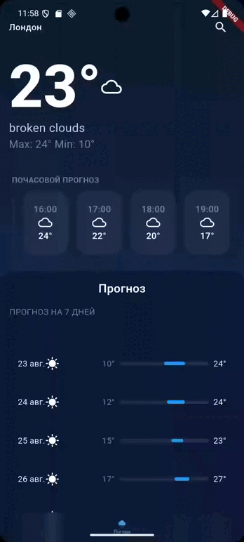

# Weather App

A Flutter weather application built with Clean Architecture and the BLoC pattern. Shows current weather and forecast either by device location or by a manually searched city, and remembers the last selected city between sessions.

## Features

- Current weather by device geolocation (temperature, description, hourly and 7-day forecast)
- City search with debounced, cancellable requests
- Persisted city selection — reopening the app loads the last chosen city instead of defaulting to GPS
- Graceful error handling: technical exceptions are mapped to plain-language messages (network issues, permission issues, service unavailability)

## Screenshots

| Home Screen | Search Screen |
|-------------|---------------|
|  |  |

## Demo

| Search & Select City |
|----------------------|
|  |


## Architecture

The project follows Clean Architecture with a strict one-way dependency rule: presentation depends on domain, data depends on domain, domain depends on nothing.

```
lib/
├── core/
├── domain/
│   ├── entity/         # weather_entity, city_entity, daily_forecast_entity, hourly_forecast_entity
│   ├── repo/            # repository.dart (интерфейс)
│   └── usecase/         # get_weather_data_usecase.dart, search_cities_usecase.dart
├── data/
│   ├── models/
│   ├── source/remote/
│   └── repo/            # repository_impl.dart
└── feature/
    ├── home_page/
    │   └── presentation/    # bloc, UI
    └── search_page/
        └── presentation/    # bloc, UI
```

Each feature is self-contained across all three layers. The domain layer defines contracts (`Repository`, `LocationService`) that outer layers implement, which keeps business logic independent of Flutter, the network client, or any third-party SDK.

### Design decisions worth noting

**Geolocation is abstracted behind a `LocationService` interface.** The `geolocator` package is only referenced inside its implementation class; the BLoC depends on the interface and an app-owned `LocationCoordinates` type. This keeps the location source swappable and, more importantly, makes the GPS code path unit-testable — platform plugins can't be mocked directly, so without this boundary that logic would have no test coverage at all.

**City name resolution avoids unnecessary network calls.** When a city is picked from search, its name is already known and is passed straight through to the weather request. Reverse geocoding only runs for GPS-based lookups, where no name is available yet.

**Search input is debounced and cancellable.** City search uses `stream_transform`'s `debounce` combined with `switchMap`: rapid typing is collapsed into a single request, and if a new query starts before a previous one resolves, the stale request's result is discarded instead of overwriting a newer state.

## Tech stack

- **State management:** flutter_bloc
- **Architecture:** Clean Architecture (data / domain / presentation)
- **Dependency injection:** injectable + get_it
- **Networking:** dio
- **Local storage:** shared_preferences
- **Geolocation:** geolocator (wrapped behind an internal interface)
- **Logging:** talker, talker_dio_logger
- **Config:** flutter_dotenv
- **Value equality:** equatable

## Testing

- `flutter_test`, `bloc_test`, `mocktail` for BLoC unit tests
- `fake_async` for deterministic testing of debounce/switchMap behavior without real time delays

Covered:
- Home BLoC: saved-city flow, GPS flow, error mapping, fallback to GPS when no city is saved
- Search BLoC: query validation, success/empty/error states, debounce collapsing rapid input, switchMap discarding stale responses

Run tests:
```
flutter test
```

## Setup

1. Get an API key from [OpenWeatherMap](https://openweathermap.org/api).
2. Create a `.env` file in the project root:
   ```
   OPEN_WEATHER_API_KEY=your_key_here
   ```
3. Install dependencies:
   ```
   flutter pub get
   ```
4. Generate DI bindings:
   ```
   dart run build_runner build --delete-conflicting-outputs
   ```
5. Run the app:
   ```
   flutter run
   ```

## API

Weather and geocoding data provided by [OpenWeatherMap](https://openweathermap.org/api).

## Author

noderunnersom Developed as a Flutter portfolio project.

---
